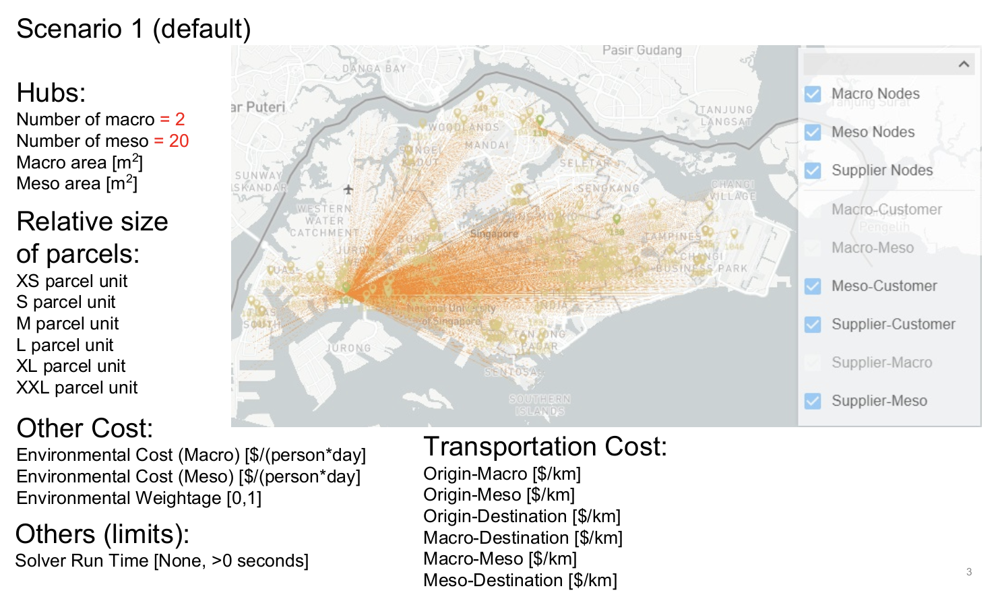
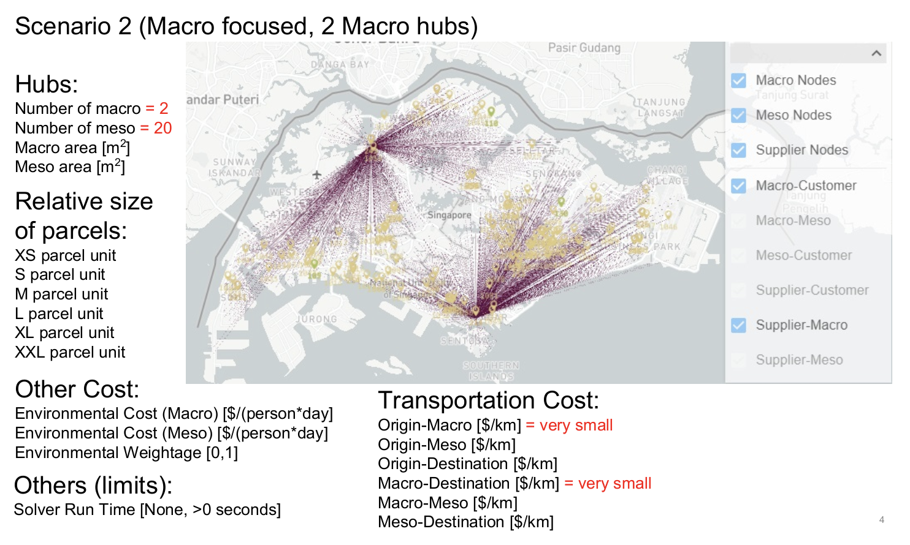
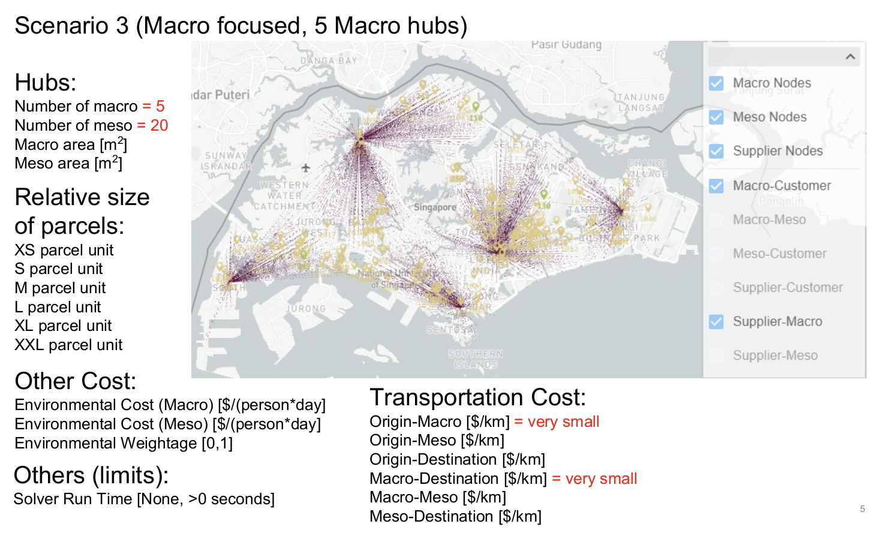
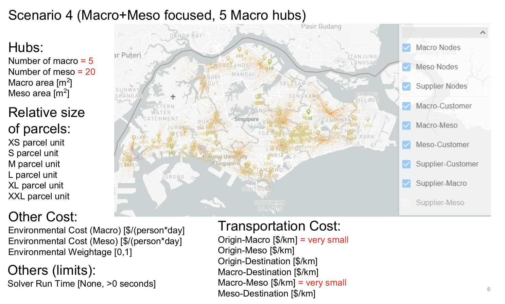

# Example Scenarios

## Scenario 1

## Scenario 2

## Scenario 3

## Scenario 4

## File Locations

### Load & Run Scenario

- `\saved_scenario\scenario_1`
- `\saved_scenario\scenario_2`
- `\saved_scenario\scenario_3`
- `\saved_scenario\scenario_4`

### Compare Scenarios

- `\fs_optimizer_results_1\results.zip`
- `\fs_optimizer_results_2\results.zip`
- `\fs_optimizer_results_3\results.zip`
- `\fs_optimizer_results_4\results.zip`