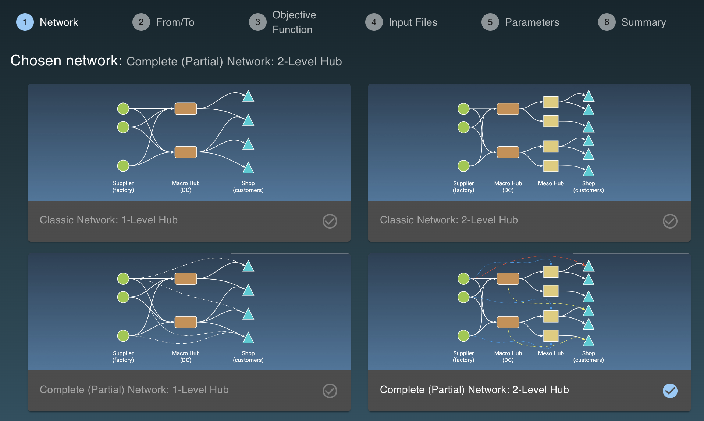
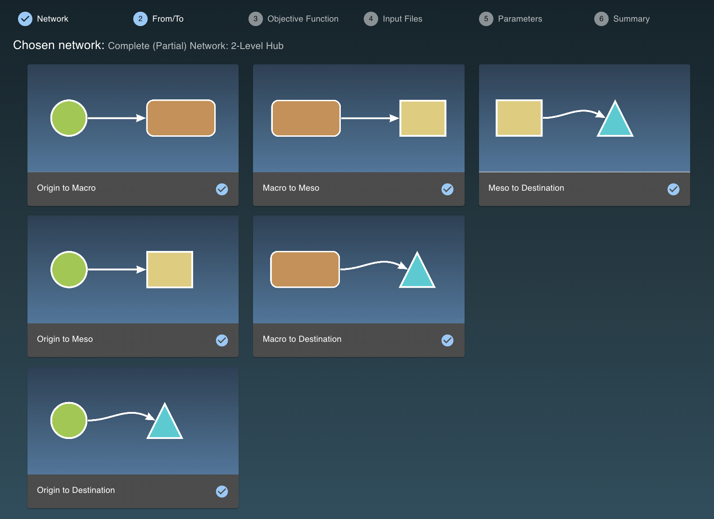
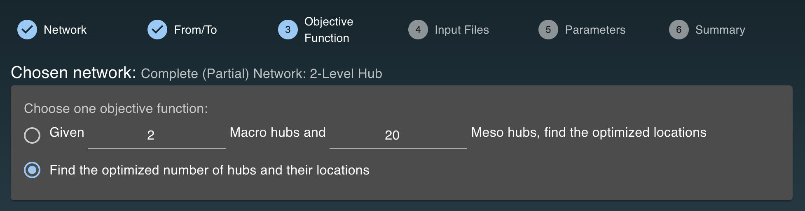
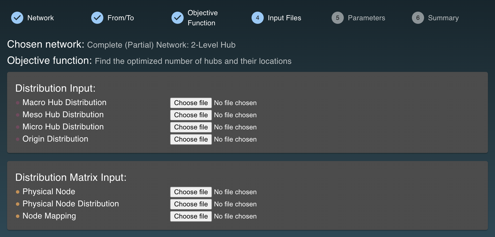
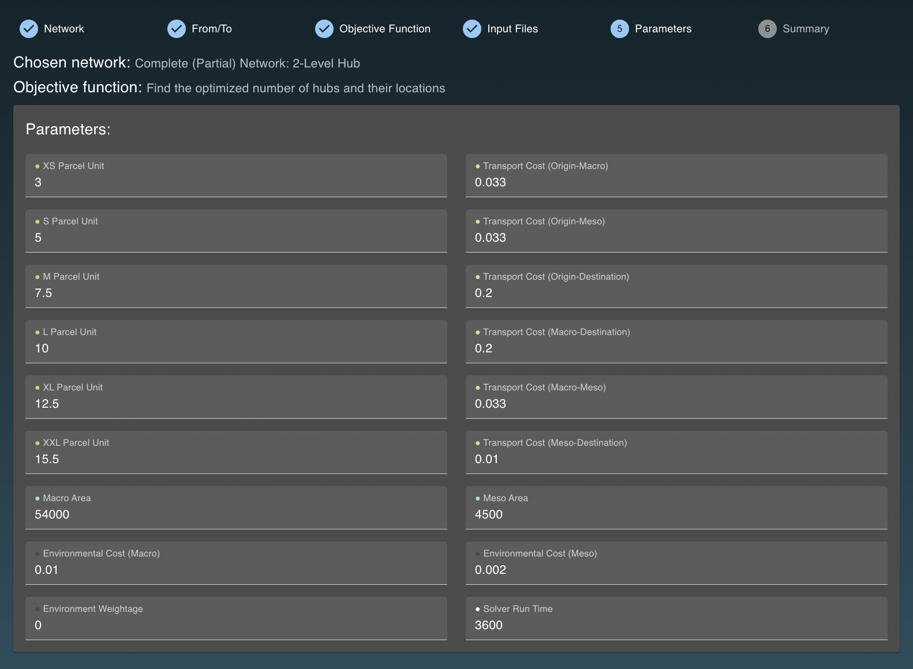
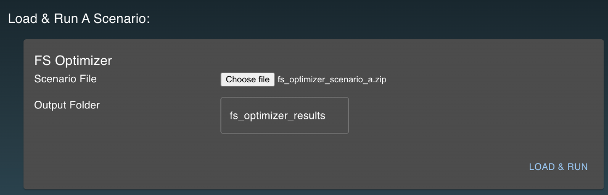
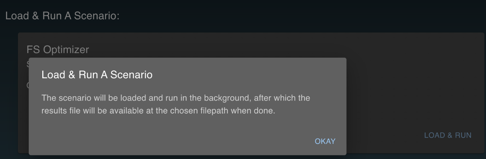
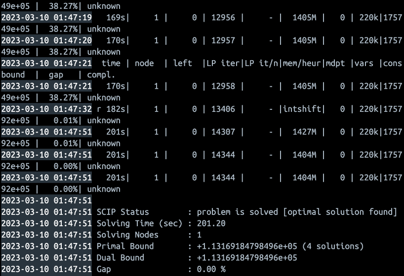
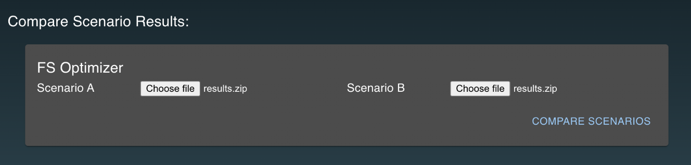
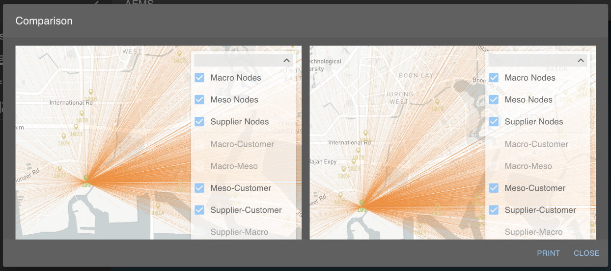

# Introduction

## Widget

### Choosing Hubs Connectivity
Choose the **network** for this scenario.

Then select **connections** you would like to optimize.

### Setting Parameters & Inputs
For the **optimization**, you may choose to optimize based on just the **locations**, or both the **locations** and number of **hubs**.

Then, put in the **input files** according to the **format required**.

Lastly, set the **parameters**, like the **weight** of parcels and **cost** between nodes.

## Load & Run Scenario

**Load and run** the scenario. Wait for it to load in the **background**. Once it is done, the **results file** will automatically be prompted for downloading.

This is what the **console log** of the optimizer looks like.

## Compare Scenarios

We can now **view the results** and compare 2 **different** scenarios.

